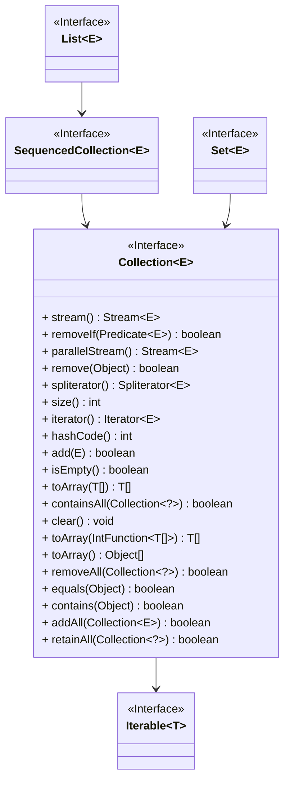

> # 3月21日 暑期实习 美团后端一面 凉经
>
> 面试官人很好，温文尔雅的技术大佬。
> \1. 问项目。
> \2. 讲讲阻塞io和非阻塞IO。讲讲有哪些常用实现。
> 3.讲讲常用的linux指令。查看日志指令tail，管道,chmod。
> 4.list和set的区别，讲讲为什么要用接口实现。
> \5. set去重，equals方法。手撕重写 equals方法。
> 6.讲讲mysql三种日志，讲讲为什么要有这三种日志。
> 7.讲讲undolog的应用，讲讲与mvcc的关系。
>
> 最后:感觉你记东西都是一个个知识点。学习还是要深入理解原理和为什么要有这个。
>
> 感觉问我东西的时候我就先吟唱八股，然后三下五除二就问到不会的地方。
>
> 想起来还问了我排序算法，选取排序算法的考量。
>
> 作者：烤串不吃串
> 链接：https://www.nowcoder.com/feed/main/detail/8ee3383c2c044a68ad1e2621031b2a46
> 来源：牛客网

### 讲讲阻塞IO和非阻塞IO。讲讲有哪些常用实现。多路复用是什么？

- 阻塞IO BIO 

  程序发起IO操作时会**一直等待**，直到操作完成后执行后续代码。

  - 系统调用
  - `read()` ` write()`

- 非阻塞IO NIO

  程序**不会等待IO完成**，继续执行后续代码。即使IO操作还没有完成，程序也可以继续执行其他任务。

  - 轮询检查IO是否完成
  - 事件机制（回调、事件处理器）返回IO结果

- IO多路复用

  允许一个程序**监控多个IO资源**，任何一个资源就绪就能处理

  

### 讲讲常用的linux指令。查看日志指令tail、管道、chmod、>和>>？

`ls -l | grep "." | awk '{print $9}' | sort `


- ` tail -n 20 install.sh >> cc.txt   ` 查看文件的后面20条数据
- `|` 管道符号表示左边为输入 ，输出到右边命令
- `ls -l | grep "." | awk '{print $9}' | sort `  当前目录下的文件列表通过管道传递给 grep 命令，用于筛选出包含 ".txt" 的文件，然后再将筛选结果通过管道传递给 awk 命令，用于提取文件名，最后通过管道传递给 sort 命令，用于对文件名进行排序。
- `chmod 755 file.txt`   
  - -rwxr-xr-x          x为1 w为2 r为4 
    - 所有者   群组   其他用户
  - `chmod -R 700 directory/`
  - `chmod u+x file.txt` 增加执行权限
- `>` 存在会覆盖；`>>` 存在会追加 


### list和set的区别，讲讲为什么要用接口实现。

灵活性、可扩展性和可替换性；**切换不同实现类**适应不同需求。

- List和Set都属于Collection
- 基于同样的接口实现，为列表和集合定义了**一组共同的方法契约**，包括添加元素、删除元素、遍历元素等操作。
  - 多态性和代码灵活性
  - 可替换性和适应不同的需求





### Set去重，equals方法。手撕重写一个类User的 equals方法。

- Set的底层其实是map，key是唯一的

```java
class User {
    int age;
    String name;

    /**
     * 检查当前User对象和另一个对象是否相等。
     * 
     * @param obj 要与当前对象比较的对象。
     * @return 如果两个对象的年龄和名字都相同，则返回true；否则返回false。
     */
    @Override
    public boolean equals(Object obj) {
        // 检查是否为同一个对象的引用
        if (obj == this) {
            return true;
        }

        // 检查传入的对象是否为null或是否与当前对象的类型相同
        if (obj == null || getClass() != obj.getClass()) {
            return false;
        }

        // 将传入的对象转换为User类型，并比较年龄和名字是否相同
        User other = (User) obj;
        if (age == other.age && other.name.equals(name)) {
            return true;
        }
        return false;
    }


    @Override
    public int hashCode() {
        return Objects.hash(age, name);
    }
}
```

```java
@Override
public boolean equals(Object o)
{
    
    if (o == this) // 同一个对象
        return true;
    if (!(o instanceof Set))  // 不是Set接口的实现
        return false;
    
    Collection<?> c = (Collection<?>) o;
    if (c.size() != size()) // 大小不一样
        return false;
    try {
        //挨个遍历，是否存在e
        for (Object e : c){ 
            if (!contains(e))
                return false;
        }
        return true;
    } catch (ClassCastException | NullPointerException unused) {
        return false;
    }
}
```

### 讲讲mysql三种日志，讲讲为什么要有这三种日志。

确保了数据库的**可靠性和一致性**

- binlog  二进制日志，用于**主从复制**，属于Mysql Server

  记录**数据库的变更操作**，包括插入、更新和删除等操作

- redolog   事务日志，用于事务回滚，InnoDB

- undolog  重做日志，用于MVCC，维护Read View表。InnoDB

### 讲讲undolog的应用，讲讲与mvcc的关系。

- undolog 为重做日志
  - 记录了事务所做的**修改操作的反向操作**
  - **事务回滚，并发控制**
- 读取一致性、版本管理
- 维护了一个**版本链**


### 排序算法，选取排序算法的考量。

- 稳定性：相等元素的相对顺序
- 时间复杂度
- 空间复杂度
- 数据分布：
  - 插入排序：部分有序，线性复杂度
  - 冒泡排序：完全逆序

### java内存模型


### 线程并发怎么保证可见性

- 每次读取都是最新的

- volatile 保证字段可见性
- syncronized ReenterLock 加锁实现原子性、可见性

### synchronized和volatile有什么区别

- volatile是syncronized的弱同步
- volatile 可见性 syncronized原子性、可见性
- volatile只能用在字段上
- syncronized可以互斥

### 线程池主要有哪些参数，阻塞队列有几种类型，拒绝策略有哪些？

```java
    public static void main(String[] args) {
        /**
         * 创建一个线程池执行器(ThreadPoolExecutor)实例。
         * <p>此线程池的核心线程数为1，最大线程数为3，线程保持活动时间为0秒，即线程池不会保留空闲线程，
         * 队列容量为2，超出队列容量的任务将使用默认线程工厂创建新线程处理，如果线程池已满，
         * 并且无法处理新任务，则会抛出RejectedExecutionException异常。</p>
         *
         * @param corePoolSize 线程池的核心线程数，即一直存在的线程数。
         * @param maximumPoolSize 线程池的最大线程数。
         * @param keepAliveTime 空闲线程的存活时间，此处设置为0，表示不保留空闲线程。如果是60，闲置非核心线程超过60秒会被回收。
         * @param unit 时间单位。
         * @param workQueue 工作队列，用于存储等待执行的任务，此处使用ArrayBlockingQueue，容量为2。
         * @param threadFactory 线程工厂，用于创建新线程。
         * @param handler 拒绝执行策略，当线程池无法处理新任务时的处理策略，此处使用AbortPolicy，即抛出异常。
         */
        ThreadPoolExecutor threadPoolExecutor = new ThreadPoolExecutor(
                1,
                3,
                0,
                TimeUnit.SECONDS,
                new ArrayBlockingQueue<>(2),
                Executors.defaultThreadFactory(),
                new ThreadPoolExecutor.AbortPolicy()
        );
        /**
         * 当有任务提交到线程池时，线程池会创建一个核心线程来执行任务。由于核心线程数为1，所以只会创建一个线程。
         * 如果任务队列未满，线程池会将任务添加到队列中等待执行。
         * 如果队列已满且活动线程数小于最大线程数（3），线程池会创建额外的非核心线程来执行任务。这些非核心线程会在任务队列中的任务被消费后被销毁。
         * 如果队列已满且活动线程数已达到最大线程数，而新的任务又提交到线程池，将会执行设置的拒绝策略 AbortPolicy。AbortPolicy 是默认的拒绝策略，它会抛出 RejectedExecutionException 异常来阻止任务的提交。
         * 当任务开始执行时，线程池中的线程会按照任务队列的顺序消费任务进行执行。
         */
    }
```

#### 线程池主要有哪些参数

- 核心线程数、最大线程数、任务队列、拒绝策略handler、keepAliveTime闲置线程的存活时间

#### 阻塞队列

- `ArrayBlockingQueue`：一个由**数组实现**的有界队列，按照先进先出（FIFO）的顺序存储元素。
- `LinkedBlockingQueue`：一个由**链表实现**的可选有界（默认情况下没有边界）队列，按照先进先出的顺序存储元素。
- `PriorityBlockingQueue`：一个支持**优先级排序**的无界阻塞队列。

#### 拒绝策略

丢弃这个或丢弃最老的、给上级线程、抛出异常

- `AbortPolicy`：默认的拒绝策略，抛出 `RejectedExecutionException` 异常，阻止任务的提交。
- `CallerRunsPolicy`：调用者运行策略，将任务返回给调用者来执行（比如让main方法来执行）。
- `DiscardPolicy`：**丢弃**策略，默默地丢弃无法处理的任务，不予任何处理。
- `DiscardOldestPolicy`：**丢弃最旧任务**策略，丢弃队列中最旧的任务，然后尝试重新提交新的任务。

### 假设有一个核心线程为4，非核心线程为8，队列长度为100，现在一起过来200个任务，是怎么工作的

- 1-4会被核心线程拿到，5-104会进入队列
  - 然后创建非核心线程，执行5-13
  - 让105-112进入队列
  - 113-200拒绝策略

### 你是怎么用redis实现分布式锁的

- 获取锁 setnx lock1 1

- 释放锁 del lock1

- Redisson

  ```java
  public static void main(String[] args) {
      // 创建 Redisson 客户端
      Config config = new Config();
      config.useSingleServer().setAddress("redis://localhost:6379");
      RedissonClient redisson = Redisson.create(config);
  
      // 获取分布式锁对象
      RLock lock = redisson.getLock("myLock");
  
      try {
          // 尝试获取锁，等待时间为10秒，锁的自动释放时间为60秒
          boolean acquired = lock.tryLock(10, 60, TimeUnit.SECONDS);
  
          if (acquired) {
              // 成功获取到锁，执行任务
              System.out.println("Lock acquired. Performing the task...");
              // 执行任务逻辑
              // 续期锁
  
          } else {
              // 获取锁失败，执行其他逻辑
              System.out.println("Failed to acquire the lock. Do something else...");
          }
      } catch (InterruptedException e) {
          // 处理中断异常
          e.printStackTrace();
      } finally {
          // 释放锁
          lock.unlock();
          // 关闭 Redisson 客户端
          redisson.shutdown();
      }
  }
  ```

### 平时有关注过一些新技术和学习吗，对这方面感觉怎么样

- 和大数据、数据仓库相关的知识

### 最近有看到或收获到什么好的学习习惯可以分享一下吗？


反问：一下子没想到要问啥，问了下基础研发平台（面的这个部门）和美团到店等其他部门有什么区别，是干什么的。面试官说了不少，简单一点来说就是他们部门主要负责底层的一些东西 最近在做一个类似阿里云的东西，到店主要负责业务这块。


作者：过路人1112
链接：https://www.nowcoder.com/discuss/600341464593215488?sourceSSR=dynamic
来源：牛客网


